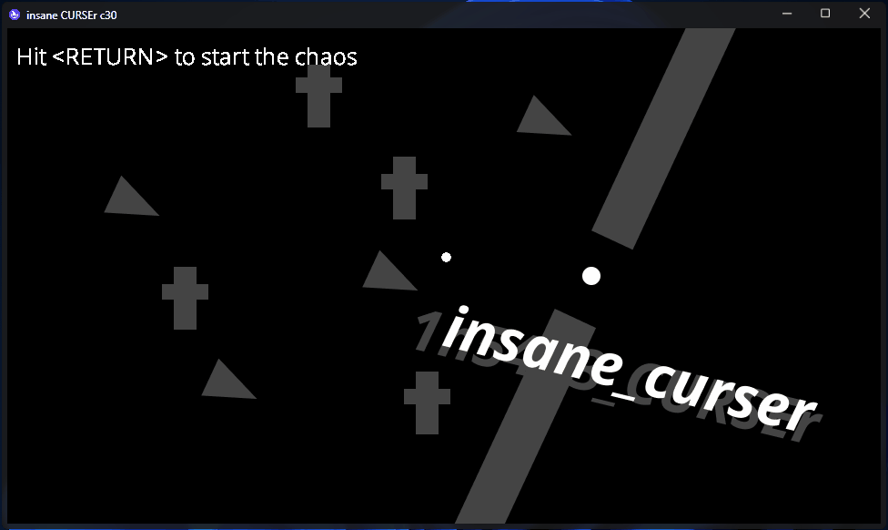

<h1 align="center">
  insane_curser
  

  
  
  
   
  
  
  
   
  
</h1>

My entry to [Micro Jam #1](https://itch.io/jam/micro-jam-1): insane\_CURSEr

Just get insane and curse your cursor!

## Credits

[Bob Nystorm](http://journal.stuffwithstuff.com/) ([@munificent](https://github.com/munificent)) for the awesome [Wren](https://wren.io) programming language

[@avivberri](https://github.com/avivberri) for making domeengine!

[warfame](https://scratch.mit.edu/users/warfame) for the original idea [Cursor Chaos](https://scratch.mit.edu/projects/99955207) on Scratch

## Resource used
OpenSans Font (c) 2022 Open Sans

